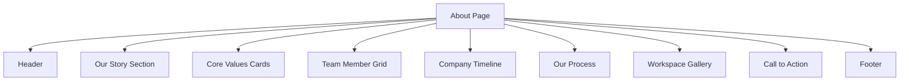

# Glasgow GFX About Page Implementation Plan

## Overview
This document outlines the comprehensive plan for implementing the About page for Glasgow GFX, maintaining consistency with the existing site design while adding new interactive elements.

## Page Structure

## Implementation Details

### 1. Header
- Reuse existing Header component
- Update navigation link from `#about` to `/about`
- Maintain dark theme with purple accents

### 2. Our Story Section
**Components:**
- StarfieldBackground (existing)
- AnimatedText (new)

**Content Requirements:**
- 2-3 paragraph company history
- Mission statement
- Vision statement

### 3. Core Values Cards
**Implementation:**
- Adapt ServiceCard component
- Add icon support using react-icons
- Hover effects matching main site

**Values to Include:**
1. Collaboration
2. Innovation  
3. User-Centered Design
4. Craftsmanship

### 4. Team Member Grid
**New Components:**
- TeamMemberCard
  - Circular profile images
  - Name and role
  - Brief bio (2-3 sentences)
  - Skills icons

### 5. Company Timeline
**Implementation:**
- Vertical timeline component
- Animated scroll effects
- Milestone markers with dates

### 6. Our Process
**Visualization Options:**
1. Step-by-step flowchart
2. Circular process diagram
3. Animated infographic

### 7. Workspace Gallery
**Requirements:**
- 3-5 high-quality workspace images
- Dark theme filter
- Lightbox functionality

### 8. Call to Action
**Implementation:**
- Reuse button styling from Header
- Consistent purple accent color
- "Start a Project" action

## Technical Specifications

### Animations
- Scroll-triggered section reveals
- Hover effects on cards
- Smooth page transitions

### Responsive Design
- Mobile-first approach
- Stacked layout for smaller screens
- Adjusted spacing for different breakpoints

### Accessibility
- Proper color contrast
- Semantic HTML structure
- ARIA labels for interactive elements

## Content Checklist
- [ ] Company history text
- [ ] Team member bios and photos  
- [ ] Core value descriptions
- [ ] Process step explanations
- [ ] Workspace images
- [ ] Timeline milestones with dates