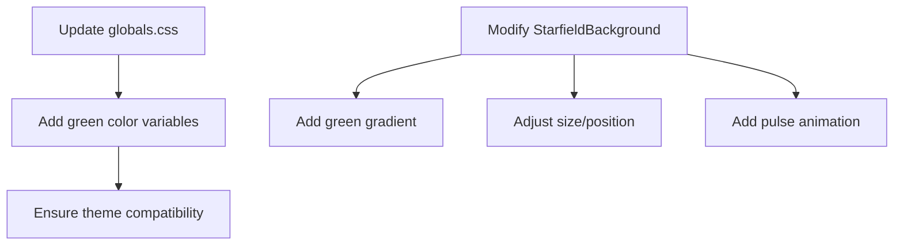

# Aurora Effect Implementation Plan

## Objective
Add a green circle background element to create an aurora-like effect in the StarfieldBackground component.

## Implementation Steps

### 1. Color Variables Update
Add to `app/globals.css`:
```css
:root {
  --green: #10b981;
}

.dark {
  --green: #10b981;
}

.light {
  --green: #34d399;
}
```

### 2. StarfieldBackground Modifications
Update `components/layout/StarfieldBackground.tsx`:
1. Add green to gradientColors array:
```ts
{ color: 'bg-green-500', opacity: 0.2 }
```
2. Adjust parameters for aurora effect:
- Size: 500-800px
- Animation duration: 10-15s
- Opacity variation: 0.1-0.3

### 3. Animation Adjustments
Add new keyframe for pulsing effect:
```css
@keyframes aurora-pulse {
  0%, 100% { opacity: 0.1; transform: scale(0.95); }
  50% { opacity: 0.3; transform: scale(1.05); }
}
```

## Implementation Diagram


## Testing Plan
1. Verify in dark/light modes
2. Check z-index with existing elements
3. Test animation smoothness