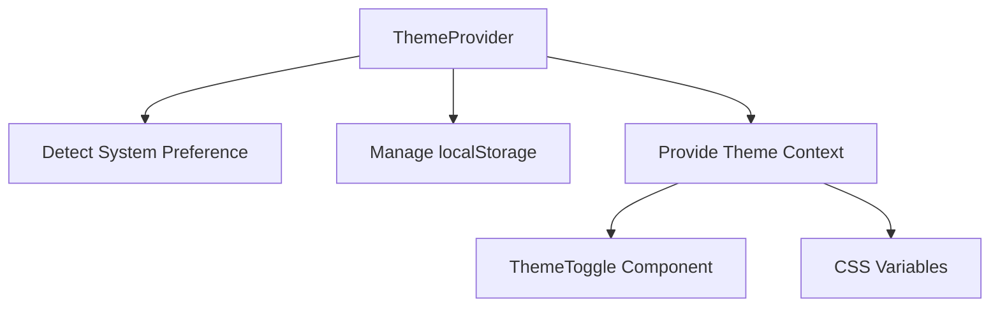

# Dark/Light Mode Implementation Plan

## Overview
Implement a theme system that:
- Respects system color scheme preference
- Allows manual override via toggle
- Persists user preference in localStorage
- Maintains existing design aesthetics

## Implementation Steps

### 1. Theme Management Architecture

### 2. File Changes

#### New Files:
- `components/ThemeProvider.tsx` - Context provider for theme management
- `components/ThemeToggle.tsx` - UI component for theme switching

#### Modified Files:
- `app/layout.tsx` - Wrap with ThemeProvider
- `components/layout/Header.tsx` - Add ThemeToggle
- `app/globals.css` - Update CSS variables
- `tailwind.config.ts` - Configure dark mode

### 3. Technical Details

**ThemeProvider.tsx:**
- Uses React context API
- Handles system preference detection (prefers-color-scheme)
- Manages localStorage for user preference
- Provides theme state to entire app

**ThemeToggle.tsx:**
- Sun/Moon icons for visual indication
- Smooth transition animations
- Accessible ARIA labels

**CSS Variables:**
- Update `:root` variables in globals.css
- Define both dark and light color schemes
- Ensure all components adapt properly

### 4. Testing Plan
1. Verify system preference detection
2. Test manual toggle functionality
3. Check localStorage persistence
4. Review all components in both themes
5. Verify no flash of incorrect theme (FOUC)

### 5. Timeline
1. Initial implementation - 2 hours
2. Component review/testing - 1 hour
3. Final adjustments - 1 hour