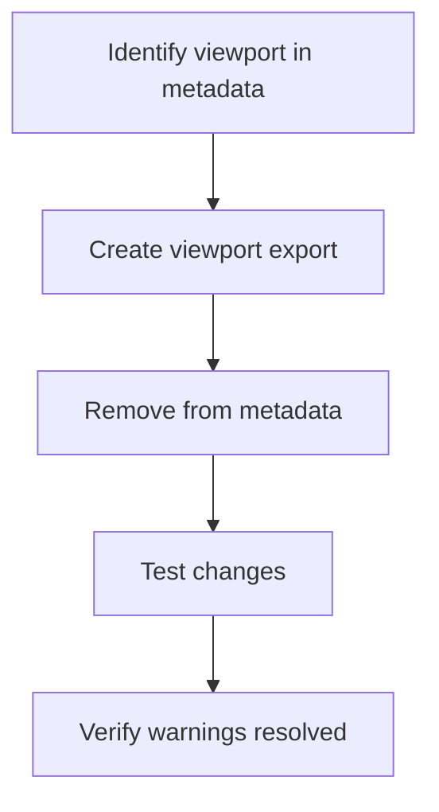

# Viewport Configuration Fix Plan

## Problem Identified
Next.js is showing warnings about unsupported metadata viewport configuration in:
- Root layout (/app/layout.tsx)
- API placeholder routes (external)

## Required Changes

### 1. Root Layout Modifications (app/layout.tsx)
Current code:
```typescript
export const metadata: Metadata = {
  title: "Nexus • Design Collective",
  description: "...",
  viewport: {  // ← This needs to be moved
    width: 'device-width',
    initialScale: 1,
    maximumScale: 1,
  },
};
```

New version:
```typescript
export const viewport = {
  width: 'device-width',
  initialScale: 1,
  maximumScale: 1,
};

export const metadata: Metadata = {
  title: "Nexus • Design Collective",
  description: "...",
  // viewport removed from here
};
```

### 2. Verification Steps
1. Check all page files for similar viewport configurations
2. Confirm no other metadata exports contain viewport settings
3. Test the application after changes

## Implementation Diagram


## Expected Outcome
- Next.js warnings about viewport configuration will be resolved
- No functional changes to the application
- Better alignment with Next.js 14+ best practices